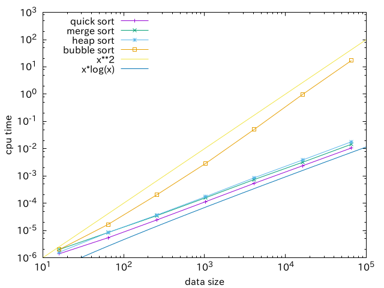

演習ではバブルソート(bubble sort)を扱ったが，クイックソート，マージソート，ヒープソートのいずれかのアルゴリズムを実装して，計算速度を測定・比較しよう．アルゴリズムについては各自で調べること．

具体的には `assignment2.f90` [^1] の最後に定義されているサブルーチン `my_sort`

[^1]: <https://amanotk.github.io/fortran-resume/template/assignment2.f90>

```fortran
  subroutine my_sort(x)
    implicit none
    integer, intent(inout) :: x(:)

    ! IMPLEMENT ME !
    call bubble_sort(x)

  end subroutine my_sort
```

を修正していずれかのソートアルゴリズムを実装すればよい．（デフォルトではバブルソートを実装したサブルーチン `bubble_sort` を呼び出すだけになっている．） `assignment2.f90` のメインプログラムではまず `bubble_sort` および `my_sort` のテストを行い，正確にソートされることを確認した後に様々なデータサイズに対する計算時間を測定・表示する．例えばデフォルトのまま実行すると以下のような出力となる．

```
$ ./a.out
checking bubble_sort ... done
checking my_sort     ... done
bubble_sort for N =     64 ... done
my_sort     for N =     64 ... done
bubble_sort for N =    256 ... done
my_sort     for N =    256 ... done
bubble_sort for N =   1024 ... done
my_sort     for N =   1024 ... done
 # data size     bubble_sort       my_sort
          16       0.116E-05     0.639E-06
          64       0.981E-05     0.312E-05
         256       0.106E-03     0.131E-04
        1024       0.130E-02     0.630E-04
```

最後に出力されるのが各データサイズに対する `bubble_sort` と `my_sort` の計算時間であるが， `my_sort` を他のアルゴリズムに置き換えることで計算時間を比較することができる．この例ではデータサイズは1024までであるが, `assignment2.f90` の中の

```fortran
  integer, parameter :: power = 4
```

で定義されている `power` を大きくすると最大のデータサイズを大きくすることができる．少し大きめ（`power = 6` など）にとった方が計算時間のデータサイズ依存性は見やすくなる．（ただし当然計算時間は長くなるので注意．）なお，最大サイズは $4^{\mathrm{power} + 1}$ で与えられる．

出力されるデータをプロットしたいときには例えば

```
$ ./a.out > assignment2.dat
$ gnuplot
gnuplot> set logscale xy
gnuplot> set format x "10^{%L}"
gnuplot> set format y "10^{%L}"
gnuplot> set xlabel "data size"
gnuplot> set ylabel "cpu time"
gnuplot> set key left top
gnuplot> plot "assignment2.dat" using 1:2 title "bubble sort" with lp, \
gnuplot>      "" using 1:3 title "my sort" with lp
```

のようにすればよい．参考までに @fig-sort にはクイックソート，マージソート，ヒープソートとバブルソートの計算時間の比較の例を示す．

{#fig-sort width=12cm}
