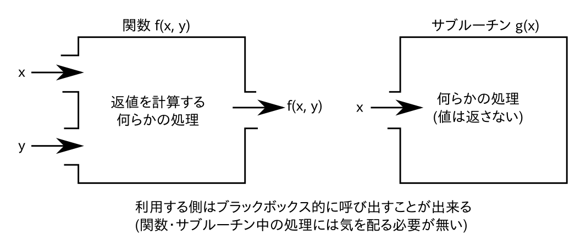
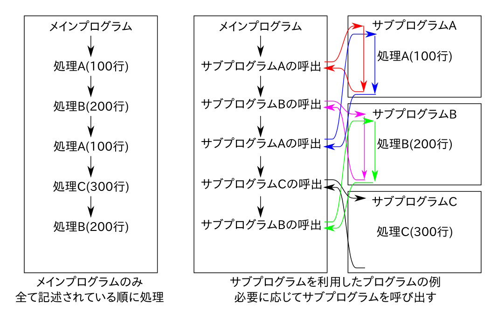

.. -*- coding: utf-8 -*-

.. highlight:: fortran
  :linenothreshold: 1

.. _c7:

==================
関数とサブルーチン
==================

これまでのプログラムは全ての処理が ``program`` から ``end program`` で囲まれた部分に記述されていたことと思う.これをメインプログラムと呼ぶ. これに対して, メインプログラム以外にもまとまった処理を1つのプログラム単位として記述しておくことが出来る. これをサブプログラムと呼んでいる. サブプログラムを用いることで同じ処理を何度も書かずに済むようになるため, プログラムを簡潔に記述することが出来る(従って無用な間違いも減らすことが出来る).

なおFortranでのサブプログラムには関数( ``function`` )とサブルーチン( ``subroutine`` )の2種類が有る [#]_.
関数は値を返すのに対してサブルーチンは値を返さないという違いが有るが, どちらも同じようなものである.
(実際にほとんどの言語でサブルーチンと関数の区別は存在しない. Fortranで言うところサブルーチンはC/C++では単に返値が ``void`` 型の関数でしかない.)
最初は少し取っ付きづらいかもしれないが, 関数やサブルーチンを使いこなせるようになると格段にプログラムの開発が楽になるので積極的に利用しよう.

    サンプルプログラム

    - `sample1.f90 <sample/chap07/sample1.f90>`_ : 関数
    - `sample2.f90 <sample/chap07/sample2.f90>`_ : サブルーチン
    - `sample3.f90 <sample/chap07/sample3.f90>`_ : 変数のスコープ
    - `sample4.f90 <sample/chap07/sample4.f90>`_ : 詳細(実践編)

概要
----

関数やサブルーチンなどのサブプログラムはひとまとまりの処理を実行する独立なプログラムと考えることが出来る. 例えば, 3次方程式 :math:`a x^3 + b x ^2 + c x + d = 0` の数値解を与えられた初期値からなんらかの反復法を用いて求める処理を考えよう [#]_.

ここで係数 :math:`a, b, c, d` の値が何であっても行う処理は基本的に同じであろう. では2つの異なる係数の組に対して数値解を知りたい場合はどうすれば良いだろうか? 同じ処理なのだからコピー＆ペーストして係数の値だけ書き換えるというのも一つの案である. しかし, 100個の異なる係数の組に対する解を知りたい場合にはどうすれば良いだろうか?
100回コピー＆ペーストするというのは得策とは言えない. このような場合には与えられた係数の組に対して処理を実行し, 結果を返す **関数** が定義されていれば, それを100回呼び出すだけである.
(:math:`\cos x` のような数学関数を思い浮かべてもらえば良い.)

このように, 何らかのまとまった処理を1つの独立したプログラム単位として定義することが出来れば圧倒的にプログラム作成が簡単になる. プログラム作成時に大事な事は人間は間違える動物であるという前提に立つことである. 間違いを少なくするには問題を簡単にするしか方法は無い. サブプログラムはそれ単体で独立したプログラムであるから, 仕様さえ確定してしまえばプログラマはそのサブプログラムの実装に集中すれば良く, それがどのように使われるかに気を使う必要は無いのである. また, サブプログラムが機能的に小さければ小さいほど(問題設定が単純になるので)実装が簡単で間違いが少ない [#]_.
従って, 規模の大きなプログラムを開発する際には, 機能を出来る限り分割した小さな関数やサブルーチン群を実装し, それらを利用して最終的に所望の機能を実装する戦略の方が圧倒的にバグが入りにくいし, またあったとしても修正が容易になる. プログラムを作成する際には関数やサブルーチンにまとめられるような処理が無いか常に注意しておくべきである.

次図は関数とサブルーチンの概念図である. いずれもひとまとまりの処理を実行するものであり, 何らかの入力を受け取り, 出力を返すことが出来る. (もちろん入力や出力は無くても良い.) ひとたび正しく実装してしまえば, 利用者(呼び出し側)はサブプログラムの内部の実装を気にする必要は無く, ブラックボックスとして用いることが出来る. (:math:`\cos x` の値を内部でどのように計算するのか意識しながら用いることは無いのと同じである.) このため, 利用者はその他の処理の実装に集中することが可能になるのである.

   関数とサブルーチンの概念図.

サブプログラムはメインプログラムとは独立したプログラムなので, メインプログラムとは他の場所に定義して呼び出すことになる. 以下の図はメインプログラムで全ての処理を実行する場合と, サブプログラムを利用する場合の処理の流れを概念的に示している. サブプログラムを呼び出すと, その定義に記述されている処理を実行し, 終了すると呼び出し元に処理が返る仕組みになっている. もちろんサブプログラムが他のサブプログラムを呼び出すことも可能である.

   サブプログラムを利用したプログラムの概念図.

定義と呼び出し
--------------

まずはサブプログラムの定義の仕方と, その呼び出し方を学ぼう.

関数
~~~~

関数とは何らかの値を返すサブプログラムであり,
以下の様な形式で定義される.

::

    型 function 関数名(引数リスト)

      変数や引数の型宣言

      処理

    end function 関数名

例えば以下は倍精度実数の2乗を返す関数の定義である.

::

    real(8) function square(x)
      implicit none  ! 暗黙の型宣言の禁止
      real(8) :: x   ! 引数の型宣言

      square = x**2  ! 関数名と同じ変数に値を代入することで, この値が返値となる

      return         ! 呼び出し元へ制御を戻す
    end function square

メインプログラムが ``program`` で始まり ``end program`` で終わるのと同様に, 関数定義も ``function`` で始まり ``end function`` で終わる一つの独立したプログラム単位である. 従って ``implicit none`` によって暗黙の型宣言を禁止し, 使用する変数は明示的に宣言をする必要がある. メインプログラムとの大きな違いは, サブプログラムには引数(この場合は ``x``)が入力として与えられることであり, 引数についてもデータ型を宣言しなければならない. 引数はカンマで区切って複数与えても良いし, それぞれが別のデータ型であっても構わない.
なおサブプログラムの定義時の引数のことを仮引数と呼び, 呼び出すときに実際に与えられる引数のことを実引数と呼ぶ. 一方, 返値は **関数名と同じ名前の変数に値を代入する** ことでそれが返値となる. 返値のデータ型は1行目先頭の ``real(8)`` で指定される. ``return`` 文はサブプログラムからその呼び出し元へ制御を戻すことを意味しており, 上のように他の処理が全て終わった後であれば省略しても構わない. 処理の途中で ``return`` することも可能で, その場合にはそれ以降の処理は行われずに呼び出し元へと制御が戻される.例えば ``if`` 文で何らかの条件判定を行い, それ以降の処理を行う必要がないと判断した場合にはその時点で ``return`` によって関数から抜けることが出来る.

なお関数宣言時に ``function`` の前に返値のデータ型を指定するのでは無く, 以下の様に ``result(変数名)`` のような形で指定することも出来る.

::

    function 関数名(引数リスト) result(変数名)

      変数や引数の型宣言

      処理

    end function 関数名

この場合は ``result`` で指定された変数に値を代入することで, それが関数の返値となる. 従って, 先ほどの ``square`` の定義は以下のように行うことも出来る.

::

    function square(x) result(y)
      implicit none
      real(8) :: x
      real(8) :: y  ! yについても宣言

      y = x**2

      return
    end function square

関数の呼出は組込み関数と全く同じで, 以下のように適宜引数を与えて呼び出せば良い.

::

      real(8) :: x

      ! 返値を代入
      x = square(3.0_8)

      ! 返値を標準出力に表示
      write(*,*) square(2.0_8)

サブルーチン
~~~~~~~~~~~~

サブルーチンは関数と良く似ているが, 値を返さないという違いがある. 定義は以下の様な形式となる.

::

    subroutine サブルーチン名(引数リスト)
      変数や引数の型宣言

      処理

    end subroutine サブルーチン名

例えば

::

    subroutine hello(name)
      implicit none             ! 暗黙の型宣言の禁止
      character(len=*) :: name  ! 文字列を引数として受け取る

      write(*,*) 'Hello ', name ! 表示

      return
    end subroutine hello

は引数で渡された文字列 ``name`` を標準出力に表示するだけのサブルーチンである. 関数と非常によく似た構造になっていることが分かるだろう. 実際に, 関数で必要だった返値の型指定が無いことを除くとほとんど同じである.

上のように定義したサブルーチンを呼び出すには以下のように ``call`` を用いなければならない.
(関数呼び出しに ``call`` を用いることはできない.)

::

      call hello('Michel')

変数のスコープ
--------------

注意しなければならないのは, サブプログラムは1つの独立したプログラム単位であるので, その中で宣言する **変数は外部の変数とは完全に独立** であるという点である. 例えばメインプログラムで宣言されている ``x`` という変数とサブプログラム中で宣言されている ``x`` という変数は完全に別のものとして扱われる. また当然サブプログラム中で使用している変数を外部から使用することは出来ない. いくつかの例外はあるものの,
基本的にはサブプログラムとメインプログラム及び他のサブプログラムは全く独立なものとして考えて良い [#]_. サブプログラムと外部の情報のやり取りは基本的には引数と返値を通じて行うものと理解して欲しい.

内部手続きと外部手続き
----------------------

サブプログラムは独立したプログラム単位なので, 定義はメインプログラムの外で行い, メインプログラムや他のサブプログラムから呼び出すことになる. 実際には以下で見るように内部手続きおよび外部手続きと呼ばれる2種類の方法があるが, この演習では内部手続きの利用を推奨することにする. それは, 内部手続きの方が間違いが少ないし, 外部手続きはモジュール中の内部手続きとして実装した方が一般的には行儀の良い(間違いの少ない)プログラムとなるためである.

内部手続き
~~~~~~~~~~

メインプログラムの ``stop`` の後に ``contains`` を挿入し, そこから ``end program`` の間に定義されるサブプログラムを内部手続きと呼ぶ.

::

    program sample
      implicit none

      メインプログラムの処理

      stop
    contains

      内部手続の定義場所

    end program sample

メインプログラムから呼び出すためには特に準備は必要無く, 以下のようにすれば良い.

::

    program sample
      implicit none

      ! 関数の呼び出し
      write(*,*) square(2.0_8)

      ! サブルーチンの呼び出し
      call hello('Michel')

      stop
    contains
      function square(x) result(y)
        定義
      end function square

      subroutine hello(name)
        定義
      end subroutine hello
    end program sample

ただし内部手続きの変数のスコープには注意しなければならない. なぜなら **メインプログラム中で宣言した変数には内部手続きからアクセスすることが出来る** (逆は出来ない)ためである. 以下の例では, 内部手続き ``sub`` からメインプログラム中に定義された変数 ``n`` にアクセスしている. しかし, もし内部手続き ``sub`` 中で変数 ``n`` が定義されている場合(13行目のコメントを外した場合)には, この変数は ``sub`` 内部のみで有効な(メインプログラム中の ``n`` とは独立な)変数になる. 一般的には, サブプログラムからメインプログラム中の変数を不用意に直接参照するのは間違いの基になりやすい. それよりは, 引数や返値を通じて値のやり取りを明示的に行う方が分かりやすいプログラムとなることが多い.

::

    program sample
      implicit none
      integer :: n = 10

      call sub()

      stop
    contains
      ! 内部手続の定義
      subroutine sub()
        implicit none
        ! もし以下の行があればメインプログラムのnとサブプログラムのnは独立
        !integer :: n

        write(*,*) n        ! メインプログラム中の変数nにアクセス
      end subroutine sub
    end program sample

外部手続き(非推奨)
~~~~~~~~~~~~~~~~~~

外部手続きは ``program`` から ``end program`` で囲まれた範囲 **以外** に定義される. メインプログラムの前でも後でもどちらでも良い. 適切にコンパイル・リンクすれば別ファイルで定義したサブプログラムを用いることも可能である.

内部手続きとは異なり, 外部手続は使うことを明示的に宣言する必要がある. これは例えば以下の様なものである.

::

    program sample
      implicit none

      ! 外部関数を呼び出すために必要
      interface
        real(8) function square(x)
          real(8) :: x
        end function
      end interface

      ! 外部サブルーチンを呼び出すために必要
      interface
        subroutine hello(name)
          character(len=*) :: name
        end subroutine hello
      end interface

      他の変数宣言やメインプログラムの処理

      stop
    end program sample

    function square(x) result(y)
      定義
    end function square

    subroutine hello(name)
      定義
    end subroutine hello

このように外部手続では ``interface`` によって関数やサブルーチンの呼び出し形式を予め宣言してから呼び出すことになる [#]_. 実はもう少しサボった( ``interface`` を用いない)書き方も出来てしまうのだが,
``interface`` を使うこと強く推奨する. なぜなら, メインプログラムの外で定義された関数やサブルーチンについてはコンパイラが(引数の数や型などの)呼び出し形式を知る方法が無いため, 間違った呼び出し方をしていてもコンパイルが通ってしまう. しかし不正な呼び出しをしているため, 当然実行時にはエラーが発生してプログラムが異常終了することになる. 一般的に実行時のエラーの方がコンパイルエラーよりも厄介でデバッグにも時間がかかるため, コンパイル時にチェックが可能な ``interface`` による宣言の方が良いのである [#]_.
(内部手続では文字通りメインプログラムの内部に定義されているので, コンパイラがメインプログラムをコンパイルする際に呼び出し形式のチェックが可能である.)

とにかく外部手続は(行儀よく使おうと思うと)面倒なので, 特に理由が無い限りは内部手続を用いる方が良い. どうしてもメインプログラムの外で手続を定義する必要がある場合にはモジュールを用いる方が間違いが少ないのである.

引数の詳細
----------

intent属性
~~~~~~~~~~

関数は返値として値を返すことが出来るが, 返値はあくまでも一つだけである. 実用的には複数の値を結果として返して欲しい場合も多いが, そのような場合には引数に結果の値を代入して返すことが出来る [#]_. このことからすぐ分かるように関数とサブルーチンには本質的な違いは無い. サブルーチンを使っても返したい値を引数に代入して返せば良いからだ. どちらを使うかは好みの問題であろう. (Fortranしか使わない人はあまり関数を使いたがらない傾向があるように思える. 一方でC言語では関数の返値はエラーチェックに使うことが多いので, C言語から入った人は関数を好むかもしれない.)

さて, 実際には引数で与えた変数の値を勝手に変更して欲しく無い場合もあるだろう. そのため, 以下のようにサブプログラムの定義時に引数の入出力特性を指定することが出来る.

-  ``intent(in)``

   入力用の変数に指定する. 値は内部で参照されるのみで変更はされない.

-  ``intent(out)``

   出力用の変数に指定する.
   サブプログラム中で値が代入されることを意味する.

-  ``intent(inout)``

   入出力のどちらにも用いる変数に指定する.
   何も指定しない場合のデフォルト.

例えば以下のように引数に属性を指定することによって意図せず第1引数 ``a`` や第2引数 ``b`` の値が変更されてしまうバグを防ぐことが出来る.

::

      ! c = a + b
      subroutine add(a, b, c)
        implicit none
        real(8), intent(in)  :: a, b
        real(8), intent(out) :: c

        ! 以下はコンパイルエラー
        !a = 1.0_8

        ! 出力用の変数に値を代入
        c = a + b

      end subroutine add

C言語の経験者はC言語の関数の引数が値渡しなのに対してFortranの関数やサブルーチンでは参照渡しであることに注意して欲しい. C言語では明示的にポインタを(またはC++での参照を)渡さない限り呼び出し元の値が変更されることは無いが, Fortranではサブプログラム中で引数の値を変更すると呼び出し元の値まで変更されてしまうのである.

配列渡し
~~~~~~~~

配列も同様に関数やサブルーチンに引数として渡すことが可能である. 以下の例の ``average1`` では任意のサイズの配列を渡すことが出来る. (ただし次元は予め指定しておく必要がある.) 配列のサイズや形状が必要であれば ``size`` や ``shape`` などの組込み関数を使って求めることが出来る. 一方で ``average2`` では配列サイズを引数として明示的に渡している. 配列の添字範囲を指定するなどの特別な事情が無い限りは ``average1`` のような書き方の方がシンプルで良い.

::

      ! 形状引継ぎ配列
      function average1(x) result(ave)
        implicit none
        real(8), intent(in) :: x(:)
        real(8) :: ave

        ave = sum(x) / size(x)

      end function average1

      ! 配列サイズを引数で渡す
      function average2(n, x) result(ave)
        implicit none
        integer, intent(in) :: n
        real(8), intent(in) :: x(n)
        real(8) :: ave

        ave = sum(x) / size(x)

      end function average2

save属性
~~~~~~~~

関数やサブルーチン内で ``save`` 属性付きで宣言された変数は前回の呼び出し時の値を記憶しておくことが出来る(C言語のstatic変数と同等である). 従って, 例えば自分が呼び出された回数を保持することなどもできる.

``save`` 属性付きの変数はプログラムの開始時に一度だけ宣言文で代入された値に初期化される. 例えば以下のサブルーチン ``fibonacci`` ではプログラムの開始時に ``n = 1``, ``f0 = 0``, ``f1 = 0`` と値が初期化されるが, 呼び出しごとに値が変更され, プログラムが終了するまでその値を内部に保持し続ける.

::

      subroutine fibonacci()
        implicit none
        ! 以下の3つがsave属性付き(初期値を指定)
        integer, save :: n  = 1
        integer, save :: f0 = 0
        integer, save :: f1 = 0

        integer :: f2

        if (n == 1) then
           write(*,*) 'Fibonacci number [', 0, '] = ', f0
           f2 = 1
        else
           f2 = f0 + f1
        end if

        write(*,*) 'Fibonacci number [', n, '] = ', f2

        ! 次回呼び出し用
        n  = n + 1
        f0 = f1
        f1 = f2

      end subroutine fibonacci

なおFortranでは変数宣言時に同時に初期化を行うと, それを自動的に ``save`` 属性付きと扱うようである. すなわち

::

      integer :: n = 1

と宣言された変数には自動的に ``save`` 属性が付加されるため ``n = 1`` に初期化されるのは一度だけである. 一方で,

::

      integer :: n
      n = 1

では毎回 ``n = 1`` に初期化される. 混乱を防ぐために ``save`` 属性付きとしたい変数は明示的に ``save`` を指定し, それ以外の変数は宣言時の初期化は避けたほうが無難である.

.. _c7_optional_keyword:

optional属性とキーワード引数 :sup:`†`
~~~~~~~~~~~~~~~~~~~~~~~~~~~~~~~~~~~~~~

引数の型宣言において ``optional`` 属性を指定した引数は省略することが出来, その引数が与えられたかどうかを検査する ``present`` という関数と共に用いる. すなわち ``present(引数)`` は引数が与えられていれば真, そうでない場合には偽を返すので, ``if`` による条件分岐と組み合わせて用いれば良い. 以下の例では引数 ``unit`` が与えられた場合にはその装置番号へ, 与えられていない場合は標準出力へと出力を行う.

::

    subroutine hello(name, unit)
      implicit none
      character(len=*), intent(in)  :: name
      integer, intent(in), optional :: unit

      integer :: u

      if( present(unit) ) then
        u = unit ! unitを指定
      else
        u = 6    ! デフォルトは標準出力
      end if

      write(u,*) 'Hello ', name ! 表示

      return
    end subroutine hello

これまで関数やサブルーチンを呼び出す際には定義時の引数ならびの順番通りに与えなければならなかった. しかしキーワード引数という機能を用いて, 順番を気にせず引数を与えることも可能である. ( ``open`` 文の使い方を思い出そう.) すなわち, 上で定義された ``hello`` を呼び出す際に

::

      call hello(unit=6, name='Albert')
      call hello(name='Einstein')

のように引数を"仮引数名 = 値"という形式で渡すことで, 引数の順番を意識せずに呼び出しが出来る.
( ``unit`` は ``optional`` 属性付きで宣言されているので省略することも出来る.)

なお, このようにキーワード引数の機能を用いるには内部手続きとして宣言するか, 外部手続きの場合には ``interface`` 宣言で明示的に仮引数名を呼び出し側に知らせてやらなければならない. (やはり外部手続きは面倒である.)

再帰呼び出し(recursive) :sup:`†`
---------------------------------

再帰呼び出しとは, 関数やサブルーチンの中で自分自身を呼び出すことである. このような再帰手続は明示的に ``recursive`` を用いて関数やサブルーチンを定義しなければならない. なお, 何も考えずに自分自身を呼び出すと簡単に無限ループになってしまうので, そうならないように注意しよう. 例えば以下は階乗の計算をする例である.

::

      recursive function fact(n) result(m)
        implicit none
        integer, intent(in) :: n
        integer :: m

        if(n == 1) then
           m = 1
        else
           m = n*fact(n-1)
        end if

      end function fact

ここで :math:`n ! = n \times (n-1) !` という漸化式を用いている. ある種のアルゴリズムは再帰を使うと非常にスッキリと書くことができるので重宝することも多いだろう. ただし関数やサブルーチンの呼び出しそのものにもコスト(時間)がかかるので, 不用意に用いるとパフォーマンスのボトルネックになることもあるため注意して欲しい.

----

.. [#]

   後で学ぶモジュールもサブプログラムになるのだが, ここではこの2つのみを考えれば良い.

.. [#]

   3次方程式には解の公式が存在するが, 実用的には反復法の方が精度や速度の面で有利なことが多い.

.. [#]

   全体像を完全に把握出来るプログラムの規模は常人にはせいぜい1000行程度が限界であろう. 実際には100行でも怪しいものである.

.. [#]

   例外としては :ref:`c9_internal_procedure` を用いる場合や, モジュールもしくはFortran 77の ``common`` を用いる場合が考えられるが, とりあえずはこのように理解して欲しい.

.. [#]

   C言語で言うところのプロトタイプ宣言である.

.. [#]

   初心者の頃はコンパイルエラーに辟易とすることが常であるが, コンパイルエラーでは一応コンパイラが(大変分かりにくくはあるものの)エラーメッセージを出力してくれるのに対して, 実行時のエラーは通常何のヒントにもならない無情な ``Segmentation fault`` のみである.

.. [#]

   他にも :ref:`c9_structure` を用いるという方法も無いこともない.
