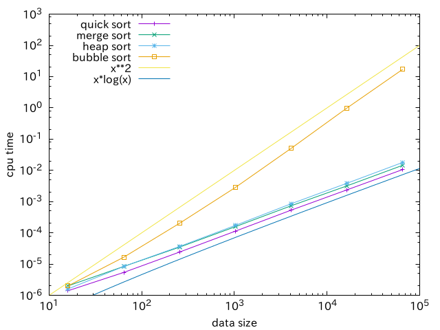
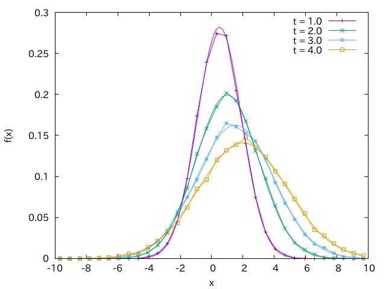

% Fortran演習 レポート課題

- レポート作成について

以下の課題から3題*以上*を選択し，レポートにまとめて提出せよ．ただし，レポートには図表を用いるなど，分かり易くする工夫を十分にすること．必要と思われる場合には用いたアルゴリズムや，ソースコードの簡単な説明，実装上の工夫などについても述べよ．(結果の図やソースコードのみを貼り付けたものはレポートとは呼べない．)

レポートは \LaTeX 等を用いて電子的に(PDFファイルとして)作成し，レポート作成に用いたプログラムのソースコードおよび，必要であればMakefileやシェルスクリプトなども提出せよ．ただしソースコードそのものはレポート本文に貼り付ける必要はなく，`.f90`形式のファイルとして提出すれば良い．また\LaTeX のソースファイルや図の作成に用いたデータファイルなどは提出しなくてよい．なおソースコードについては適切な字下げ(emacsのTabを活用せよ)やコメントの挿入(日本語・英語どちらも可)など，他人にとって読み易くなっているものが好ましい．


なおいくつかの課題ではレポート課題に取り組むにあたってこちらが用意したファイルが必要になるので，まずは必要なファイルを手元にコピーしておくこと．例えば自分のホームディレクトリ直下の`report`というディレクトリにコピーするには

```
 $ cd ~/report
 $ wget https://amanotk.github.io/fortran-resume-public/report/files.tar.gz
 $ tar -zxvf files.tar.gz
```

とすれば`~/report/files`以下に必要なファイルが展開される．

質問・相談は理学部1号館8F 803で直接，もしくは`amano@eps.s.u-tokyo.ac.jp`で随時受け付ける．

- 提出期限と提出方法

提出期限は2019年6月2日(日)の23:59 JST(日本標準時)とする．提出は <https://goo.gl/oNJtEx> から`tar.gz`形式のファイルをアップロードすること．

- 提出用ファイルの作成方法

```
 $ cd ~
 $ mkdir ~/${USER}_fortran
```

するとホームディレクトリに`s??????_fortran`というディレクトリが出来るので，提出したいファイルを
全てこのディレクトリにコピーする．例えば

```
 $ cp fortran.pdf kadai2.f90 kadai3.f90 ~/${USER}_fortran
```

などとする．(この例では`fortran.pdf`と`kadai2.f90`，`kadai3.f90`をコピーしている．)

この状態で

```
 $ cd ~
 $ tar -zcvf ${USER}_fortran.tar.gz ${USER}_fortran
```

すればホームディレクトリに`s??????_fortran.tar.gz`というファイルが出来るので，これをアップロードすれば良い．


# 感想
全8回のFortran演習およびレポート課題など全般に対する感想を述べよ．(難易度，演習で分かったこと，分からなかったこと，などなど．内容については問わないので何でも正直に．)

# 多倍長演算
通常の浮動小数点数(実数)の精度には限りがあり，任意精度で近似値を求めたい場合には用いることが出来ず，多倍長演算(または任意精度演算)と呼ばれる手法を用いることになる．ここでは多倍長演算が用いられる代表例である円周率$\pi$の計算を考えよう．

以下では最も簡単な実装を考える．まず任意の数値$x$を10進数で

$$
x = (-1)^s \sum_{j=1}^{N} \tilde{x}_j \times 10^{- j + e}
$$

の形で表そう．ここで$\tilde{x}_{j}  \in \left\{0, 1, 2, 3, 4, 5, 6, 7, 8, 9\right\}$は各桁の数値を，$s \in \left\{0, 1\right\}$は符号を， $e \in \mathcal{Z}$ は値の絶対値を保持するための整数である．従って項数$N$を十分大きく取り，$\tilde{x}_{j}$を配列として保持すれば，メモリの許す限り任意の精度(桁数)で数値を表すことが出来る．例えば $x = 1.41$ を表すには $N \geq 3$ とし， $\tilde{x}_1 = 1, \tilde{x}_2 = 4, \tilde{x}_3 = 1$ ($\tilde{x}_4$以降は全て0)， $s = 0, e = 1$ とすれば良い．なお以下の円周率の計算では $s = 0, e = 1$ の場合が扱えれば十分であるので常にこれを仮定しても良い．すなわち，小数点以下$N$桁までの数値は長さ$N$の整数配列で表すことが出来る．(整数部まで含めれば長さは$N+1$である．)

ここでは円周率の計算に，Machinの公式および$\tan^{-1}(x)$のTaylor展開を用いることによって得られる以下の級数展開を用いよう．

$$
\pi =
\sum_{k=0}^{\infty} \frac{(-1)^k}{2 k + 1} \left( a_k - b_k \right) =
(a_0 - b_0) - \frac{a_1 - b_1}{3} + \frac{a_2 - b_2}{5} - \frac{a_3 - b_3}{7} \cdots
$$

ただし

$$
a_k \equiv 16 \left( \frac{1}{5} \right)^{2 k + 1}
\\
b_k \equiv 4 \left( \frac{1}{239} \right)^{2 k + 1}
$$

と置いた．簡単な評価から，小数点以下 $l$ 桁目まで(ただし $l \gg 1$ )を正しく求めるには $k = [l / 2 \log_{10} (5)]$ 程度までで上記の級数を打ち切って良いことが分かる．

ここで，$a_{k+1} = a_{k} / 5^2$，$b_{k+1} = b_{k} / 239^2$で与えられることに注意すれば，

- 多倍長数同士の加算(足し算)
- 多倍長数同士の減算(引き算)
- 多倍長数の整数(通常の`integer`)での除算(割り算)

が実装出来れば円周率の計算が出来ることが分かる．筆算の要領でこれらの演算を実装し，実際に円周率の多倍長計算を行うプログラムを作成せよ．以下は小数点以下100桁までを求めた結果である．

```
$ ./a.out 100
PI = 3.1415926535 8979323846 2643383279 5028841971 6939937510
       5820974944 5923078164 0628620899 8628034825 3421170679
```

この例ではコマンドラインで求める桁数(この場合は100)を与えている．このようにコマンドライン引数を利用するには，サブルーチン `get_command_argument` (Fortran 2003以降では標準)を利用すると良い．ただし，必ずしもこの例のように実装する必要は無く，標準入力から項数を読み込むようにしても良い．


なお結果の確認用プログラムとして `kadai2.py` を用意してある．例えば小数点以下10000桁までを求めるには以下のように実行すれば良い．

```
$ ./kadai2.py 10000
PI = 3.1415926535 8979323846 2643383279 5028841971 6939937510
       5820974944 5923078164 0628620899 8628034825 3421170679
# ... 中略 ...
       2645600162 3742880210 9276457931 0657922955 2498872758
       4610126483 6999892256 9596881592 0560010165 5256375678
```

もし`kadai2.py`でエラーが出た場合には
```
$ /home2/amano/anaconda2/bin/python ./kadai2.py 10000
```
のように実行すること．
(自分で構築したpython環境を使う場合は`mpmath`モジュールをインストールが必要である．）


# 太陽風(求根法)
太陽風の基本的性質は定常で1次元球対称の圧縮性流体方程式で記述される(Parkerの太陽風理論)．このモデルは一般の恒星風や，惑星大気の流体力学的散逸を理解するにあたって基礎となっている． ここで，ポリトロピックな状態方程式$p \propto \rho^{\gamma}$を採用すると，太陽風の速度$u$の距離$x$に対する依存性は以下の方程式の解として与えられる．
$$
  u^{\gamma+1}
  - \left( \frac{4}{x} + \epsilon \right) u^{\gamma-1}
  + \frac{2}{\gamma - 1} x^{2 - 2\gamma} = 0.
$$
ただし，$x \equiv r/r_{c}$は臨界点の距離$r_c$で規格化した太陽中心からの距離，$u = v / a_{c}$は臨界点での音速$a_c$で規格化した速度，$\epsilon = (5 - 3 \gamma) / (\gamma-1)$は規格化されたエネルギーに対応する保存量である．なお，$\gamma$は比熱比で，太陽風に対応する物理的な解を持つためには$1 < \gamma < 5/3$の範囲になければならない．この時，$x \rightarrow \infty$の極限を取ると，無限遠での速度が$u_{\infty} = \sqrt{\epsilon}$となる．

この方程式を数値的に解くプログラムを作成し，速度$u$および，局所的な音速$a = x^{1-\gamma} u^{(1-\gamma)/2}$で定義されるマッハ数$M = u/a$を距離の関数として図示せよ．無限遠での速度が$\sqrt{\epsilon}$に漸近することを確かめること．ただし，太陽風に対応する物理的な解( $x < 1$ で亜音速 $M < 1$， 臨界点 $(x, u) = (1, 1)$ を通り， $x > 1$ で超音速 $M > 1$ となる解)を求めること(それ以外にも解が存在する)． 図示する際には横軸 $x$ はログスケールとし，太陽近傍$x \ll 1$から十分遠方$x \gg 1$までの依存性が分かるようにすること．また，いくつかの異なる比熱比(例えば$\gamma = 1.3, 1.4, 1.5, 1.6$など)についての解を比較せよ．

## ヒント {-}

- ある$x$に対して物理的な解を見つけてしまえば，それを初期値として用い，その近傍の$x$に対する物理的な解がすぐに見つかる．例えば臨界点 $(x, u) = (1, 1)$ が解になっていることは直ちに確かめられるので，ここから少しずつ$x$を変化させて数値解を求めていけば良い．小さな $\delta$ (例えば0.05) に対して， $x_{new} = (1 \pm \delta) x_{old}$ のように $x$ を変化させながら解を求めていくと$x \ll 1$から$x \gg 1$までの広い範囲の解を求める際にも効率が良い．
- 物理的内容は理解していなくても出来るようになっているので臆せず挑戦して欲しい．
- 参考文献

  Lamers, H. J. G. L. M., Cassinelli, J. P., 1999, Introduction to Stellar Winds (Chapter 4.2), Cambridge University Press

  電子版: <http://ebooks.cambridge.org/ebook.jsf?bid=CBO9781139175012> (例えば図4.1)


# セルオートマトン
セルオートマトン(Cellular Automaton)と呼ばれるモデルを実装しよう．1次元的に並んだN個のセルが与えられ，各セルが0もしくは1という状態を持つとき，これを$x_i (i=1, \ldots, N)$と表す．セルオートマトンでは$k$世代目の$x^k_{i-1}, x^k_{i}, x^k_{i+1}$の状態からある規則に基づいて$k+1$世代目の$x^{k+1}_i$を決定する．$x^k_i$は0か1の2通りなので，$x^k_{i-1}, x^k_{i}, x^k_{i+1}$の組111, 110, 101, 100, 011, 010, 001, 000の8パターンに対する$x^{k+1}_{i}$を指定すれば良い．例えば 111→0, 110→0, 101→0, 100→1, 011→1, 010→1, 001→1, 000→0 という規則は$x^{k+1}_{i}$を並べたものを2進数表記の整数と見ると $00011110_2 = 30_{10}$ (2進数表記の00011110は10進数では30)となるためルール30と呼ばれている．このようなセルオートマトンに基づくセルの状態遷移を計算するプログラムを作成せよ．ただしプログラムは以下の仕様を満たすものとする．

- 標準入力からルールを表す10進の整数，セル数$N$，状態遷移を計算するステップ数$M$および，$N$個分の初期条件をこの順で読み込むものとする．`kadai4_1.txt`, `kadai4_2.txt`, `kadai4_3.txt` はこの書式で記述されたファイルになっているので，これらをリダイレクトで読み込ませることが出来れば良い．
- 計算には境界条件(端の値 $x_1$および$x_N$)が必要になるが，これは初期値のままで固定とする．(すなわち，$x_2$から$x_{N-1}$までを更新すれば良い．)


このプログラムに `kadai4_1.txt`, `kadai4_2.txt`, `kadai4_3.txt` を入力として与えた場合の状態遷移の様子を図示せよ．例えば `kadai4_1.txt` を入力として，結果を `kadai4_1.dat` に書き込む場合には

```
 $ ./a.out < kadai4_1.txt > kadai4_1.dat
```

のように実行出来れば良い．

## ヒント {-}
- ルールは長さ8の整数配列を用いて記述することが出来る．$x^k_{i-1}, x^k_{i}, x^k_{i+1}$の組をこの整数配列のインデックスに(例えば$j = 2^0 \times x^{k}_{i-1} + 2^1 \times x^{k}_{i} + 2^2 \times x^{k}_{i+1}$のように)マッピングしてやると良い．
- 出力したファイル(以下では`data.dat`)をgnuplotで図示する際には

```
 > set palette gray negative
 > plot 'data.dat' matrix with image
```

などとすると良いかもしれない．(ただし出力するデータファイルの形式に依存する．)


# ヒルベルト曲線

2次元の単位正方形を $2^{n+1} \times 2^{n+1}$ の均等なセルに分割しよう．これらの全てのセルの中心を一度ずつ通る連続した交わることのない曲線を空間充填曲線(space-filling curve)と呼ぶ．ヒルベルト曲線はこの空間充填曲線の一つの例である．与えられた任意の非負整数 $n \geq 0$ についてヒルベルト曲線を生成するプログラムを作成し，例えば$n = 0, 1, 2, 3, 4, 5$のヒルベルト曲線を図示せよ．(点列をファイルに出力し，gnuplot等で図示すれば良い．）

なお，2次元のヒルベルト曲線は以下の図のようにカタカナの「コ」の字およびそれを回転させた4つの図(LDR, URD, RUL, DLU)を基準とし，これらの曲線を再帰的に接続していったものになっている(図参照）．$m$次のヒルベルト曲線を下付き添字 $_{m}$ で表すと，これは$m-1$次のヒルベルト曲線とそれらをつなぐ直線によって以下のように再帰的に定義することが出来る．

$$
\begin{matrix}
{\rm LDR}_{m} &:
{\rm DLU}_{m-1} \rightarrow & {\rm L} \rightarrow &
{\rm LDR}_{m-1} \rightarrow & {\rm D} \rightarrow &
{\rm LDR}_{m-1} \rightarrow & {\rm R} \rightarrow &
{\rm URD}_{m-1}
\\
{\rm URD}_{m} &:
{\rm RUL}_{m-1} \rightarrow & {\rm U} \rightarrow &
{\rm URD}_{m-1} \rightarrow & {\rm R} \rightarrow &
{\rm URD}_{m-1} \rightarrow & {\rm D} \rightarrow &
{\rm LDR}_{m-1}
\\
{\rm RUL}_{m} &:
{\rm URD}_{m-1} \rightarrow & {\rm R} \rightarrow &
{\rm RUL}_{m-1} \rightarrow & {\rm U} \rightarrow &
{\rm RUL}_{m-1} \rightarrow & {\rm L} \rightarrow &
{\rm DLU}_{m-1}
\\
{\rm DLU}_{m} &:
{\rm LDR}_{m-1} \rightarrow & {\rm D} \rightarrow &
{\rm DLU}_{m-1} \rightarrow & {\rm L} \rightarrow &
{\rm DLU}_{m-1} \rightarrow & {\rm U} \rightarrow &
{\rm RUL}_{m-1}
\end{matrix}
$$

ここでU, D, L, Rはそれぞれ上下左右に長さ$1/2^{n+1}$の直線を引くことを意味する．

{width=14cm}


## ヒント {-}

- 最も簡単な実装は再帰的サブルーチンもしくは関数(`recursive`)を用いて上記の関係を表現する方法であろう．
- 曲線を表す点列の座標値を保持し，この値を順次更新しながら出力していけばよい．例えばUなら$y \rightarrow y + 1/2^{n+1}$，Lならば$x \rightarrow x - 1/2^{n+1}$など．


# ソート
演習ではバブルソート(bubble sort)を扱ったが，これに加えてヒープソート(heap sort)，マージソート(merge sort)，クイックソート(quick sort)などのアルゴリズムを用いた場合の計算速度を測定・比較しよう．

`kadai6.f90` に定義されているメインプログラムでは，まず正確にソートされているかのテストを行い，様々なデータサイズに対して実際に計算時間を測定する．このメインプログラムでは各アルゴリズムを用いた整数配列に対するソートのサブルーチンがモジュール `mod_sort` の内部手続きとして `bsort` (バブルソート)，`hsort` (ヒープソート)，`msort`(マージソート)，`qsort`(クイックソート)として定義されているものと仮定する．これらのサブルーチンは `kadai6_sort.f90` のモジュール `mod_sort` の内部手続きとして予め定義されているが，`hsort`， `msort`，`qsort`の中身は全てバブルソート(`bsort`を呼出すだけ)になっている．これら3つのサブルーチンのうち最低1つ以上を正しく実装し，計算時間の測定結果を図示せよ．ただし新しく実装したサブルーチンの計算速度の計測を行うには，`kadai6_sort.f90` のフラグ `test_?sort` (`?`は`q`，`m`， `h`，`b`のいずれか)の値も変更する必要がある．例えば `qsort` を正しく実装し，計算時間の測定を行うには `test_qsort` の値を `.true.` に変更すること．

具体的には，サブルーチンを実装しフラグの値を変更した後に，以下のようにコンパイル・実行し，出力結果(以下の例では`kadai6.dat`)をgnuplot等を用いて図示すれば良い．ただし縦軸・横軸ともに対数スケールとすること．また，計算時間のデータサイズ$N$に対する依存性が理論的な関係性を満たすことも確認せよ．(図参照．バブルソートでは$O(N^2)$，それ以外のアルゴリズムは全て$O(N \log N)$の依存性を持つ．)

```
 $ gfortran kadai6_sort.f90 kadai6.f90
 $ ./a.out > kadai6.dat
```

例えば `kadai6.dat` の中身は以下の様になるだろう．

```
      16       0.163E-05   0.298E-05   0.206E-05   0.198E-05
      64       0.755E-05   0.132E-04   0.950E-05   0.231E-04
     256       0.395E-04   0.548E-04   0.553E-04   0.251E-03
    1024       0.166E-03   0.216E-03   0.236E-03   0.361E-02
    4096       0.763E-03   0.938E-03   0.110E-02   0.626E-01
   16384       0.311E-02   0.422E-02   0.512E-02   0.120E+01
   65536       0.136E-01   0.185E-01   0.232E-01   0.206E+02
```

左からソートする配列の長さ，`qsort`，`msort`，`hsort`，`bsort`のそれぞれについての計算時間である．ただし実際の値はこれとは異なるだろう．なお，`test_?sort` が `.false.` の場合は計算時間は(測定されずに)0となる．

{width=9cm}


# 乱数(モンテカルロ法)
以下の移流拡散方程式

$$
 \frac{\partial f}{\partial t} + U \frac{\partial f}{\partial x} =
  D \frac{\partial^2 f}{\partial x^2}
$$

は例えば物質の密度分布$f(x, t)$の速度$U$での移流および拡散係数$D$での拡散を表す方程式であり，多くの場面で登場する非常に重要な方程式である．差分法などを用いた解法はこれからの演習で学ぶことになるが，ここでは乱数を用いた解法を考える．

ある粒子の位置$x$が時刻$\tau$ごとに等確率で$x + \Delta$もしくは$x - \Delta$に移動するとき，この粒子の運動をランダムウォーク(random walk)と呼ぶ．ランダムウォークの試行回数$n$を無限大とした極限$n \rightarrow \infty$で，粒子の存在確率分布$P(x)$が拡散方程式に従うことが示され，拡散係数は$D = \Delta^2 / 2 \tau$によって与えられる．従って，ある時刻における物質の密度分布$f(x, t)$を有限個の粒子の重ね合わせで近似し，個々の粒子の運動をランダムウォークによって記述すれば得られる粒子の分布は拡散方程式の近似解を与える．移流項については全ての粒子について，一定の移動速度$U$の効果を加えればよい．なお，以下では$x$の範囲は無限空間($-\infty < x < \infty$)とし，$\lim_{x \rightarrow \pm \infty} f(x) = 0$なる境界条件を採用する．(要するに境界条件は考えなくてよいということである．)

#. $U = 0$，$D = 1$として移流拡散方程式の数値解(時間発展)を求めよ．ただし初期条件はデルタ関数$f(x, 0) = \delta (x)$とする．用いる粒子数や時間ステップに対する依存性について考察すること．(適当なパラメータを用いれば図のように解析解と数値解はよく一致するであろう．)
#. 同じ条件の元で$U = 0.2, U = 2.0$の場合についてもそれぞれ数値解を求めよ．

## ヒント {-}

- ある時刻の$f(x, t)$を有限個の粒子で近似するには，例えば$N$個の粒子を用いるならばプログラム中で各粒子の$x$座標を表す長さ$N$の配列を用意すればよい．問題では初期条件がデルタ関数$f(x, 0) = \delta (x)$で与えられているが，これは初期に全ての粒子の$x$座標を0にしておくことに相当する．
- 時間発展の結果を図示する際には粒子の分布から適当なビン幅でヒストグラムを作成し，それを$f(x)$と考えればよい．ただし規格化(即ち$\int_{-\infty}^{\infty} f(x) = 1$)に注意せよ．(ヒストグラムを作成するサブルーチンは演習課題の解答例にあるハズなので，これを適宜用いて良い．)
- ランダムウォークは乱数を用いて実装すればよい．即ち各粒子の位置$x_i (t) (i=1, 2, \ldots, N)$を時間ステップ$\tau$進めるには

$$
 x_i (t + \tau) = x_i (t) + U \tau \pm \sqrt{2 D \tau}
$$

とすればよい．ここで符号$\pm$を各ステップごと，各粒子ごとにランダムに選ぶ．(例えば$[0, 1)$区間の一様乱数$r$を発生させ，$r < 0.5$の時には$+$，それ以外では$-$を選ぶ．)

- 無限区間において初期条件がデルタ関数$f(x, 0) = \delta(x)$で現されるときの解析解(Green関数)は

$$
 f(x, t) = \frac{1}{2 \sqrt{\pi D t}}
    \exp \left( - \frac{(x - U t)^2}{4 D t} \right)
$$

で与えられる．

{width=9cm}


# マッチング問題

Gale-Shapleyアルゴリズム(またはDeferred Acceptanceアルゴリズム)と呼ばれるマッチングアルゴリズムを実装しよう．なお，これは駒場進学選択で導入された受入保留アルゴリズムと同じものである(らしい)．

## 安定結婚問題 (Stable Marriage Problem)

$N$人の男性と女性のマッチング問題を考えよう．ただし，各個人が全ての異性について好みのランキングリストを持つとする．なお，ランキングに同点は無いものとし，また同性婚，一夫多妻制，一妻多夫制などは考えない．このとき全員の好みが可能な限り満たされるようなマッチングを実現したい．

以下の擬似コードで表すGale-Shapleyアルゴリズムは，この問題に対して安定なマッチングを実現する．ここで安定とは，任意の2つのペアを選び，互いに相手を交換しても，現在よりも互いに好みになることが無いという意味である．

```
初期には男性も女性も全員が独身であるとする．

do while( まだリストの全女性にプロポーズしていない独身男性が存在する )
  そのような男性mを1人選ぶ．
  wをmがまだプロポーズしていない女性のうち，最も好みの女性とする．

  if( wが独身 ) then
    mとwは婚約する．
  else
    wと婚約状態にある男性をm'とする．
    if( wがmよりもm'を好む ) then
      m'とwの婚約は継続し，mは独身のままとする．
    else
      m'とwの婚約を破棄し，mとwは婚約し，m'は独身に戻る．
    end if
  end if

end do
```

このアルゴリズムを実装し，標準入力から好みのランキングリストを読み込んで，マッチングを行うプログラムを作成せよ．ただし，男女共に $i = 1 \ldots N$ の番号で個人を識別し，読み込むファイルの形式は以下のようなものとする．

```
4        # N

1 2 3 4  # 男性1の好み女性ランキング
3 2 1 4  # 男性2の好み女性ランキング
1 2 4 3  # 男性3の好み女性ランキング
3 1 4 2  # 男性4の好み女性ランキング

1 2 3 4  # 女性1の好み男性ランキング
2 1 4 3  # 女性2の好み男性ランキング
2 3 1 4  # 女性3の好み男性ランキング
1 4 3 2  # 女性4の好み男性ランキング
```

作成したプログラムは`kadai8_1a.txt`や`kadai8_1b.txt`を読み込ませて結果を確認せよ．例えば

```
 $ ./a.out < kadai8_1a.txt
F[  1] <=> M[  1]
F[  2] <=> M[  3]
F[  3] <=> M[  2]
F[  4] <=> M[  4]
```

のようにマッチング結果を出力すれば良い．ここでは女性を `F` (female)，男性を `M` (male)とし，例えば `F[  1] <=> M[  1]` は女性1と男性1がペアになったことを意味する．(この例では男女ともに全ての異性にランキングを付けているので必ず全員がペアになることが保証されている．)


## 進学選択問題 $^\dagger$

安定結婚問題よりも一般的なマッチング問題として，進学選択問題を考えよう．すなわち

- 学科数と学生数は異なる．
- 各学科は学科ごとに決められた定員までは受け入れが可能である．
- 学生は必ずしも全ての学科を志望する必要は無い．
- 各学科は各科目の試験成績の重みを付け平均点をもとに学生のランキングを決定する．ここで重み係数は各学科ごとに異なってもよい．ただし同点となる場合については考えなくてよい．

とする．

このとき，学科数，科目数，学科定員，各学科ごとの重み係数，各学生の試験成績および志望学科リストのデータを読み込み，マッチングを行うプログラムを作成せよ．なおデータファイルの形式は以下のように，学科数と科目数，各学科の定員(例: 数学科，情報科学科，物理学科，天文学科，地球惑星物理学科，地球惑星環境学科，化学科，生物化学科，生物情報科学科，生物学科)および重み係数，各学生について各科目の得点(実数)と志望学科が記述されている．なお，学科，学生ともに出現順にID($i = 1, 2, \ldots$)を付与し，学生の志望リストは学科IDで表す．ただし，志望学科リストに負のIDが指定されている場合は，それ以上志望学科が無いことを表す．(以下の例では学生1は第4志望までしか指定していない．)

```
10  3                         # 学科数，科目数

  4   0.25   0.25   0.50      # 学科1の定員，重み係数(3科目分)
  2   0.50   0.25   0.25      # 学科2の定員，重み係数(3科目分)
# 以下学科数分続く


40                            # 学生数

# 科目1, 科目2,  科目3      第1志望, 第2志望, ...
29.84   21.20   42.98       3    9    1    6   -1   -1   -1   -1   -1   -1
59.65   40.78   67.79       8    7    6    3    9    1    5   -1   -1   -1
# 以下学生数分続く
```

なお上の例では学科1は学生のランキングを
$$科目1 \times 0.25 + 科目2 \times 0.25 + 科目3 \times 0.50$$
で計算するが，学科2は
$$科目1 \times 0.50 + 科目2 \times 0.25 + 科目3 \times 0.25$$
により計算するものとする．すなわち学科によって学生のランキング順序が異なることに注意せよ．

このデータファイルを例えば以下のように読み込みマッチング結果を表示するプログラムを作成せよ．なお，全ての学生が振り分けられるわけではない(マッチングに失敗する学生がいる)ことも考慮すること．例えば`kadai8_2a.txt`に対して実行すると，以下のような結果が得られるだろう．`kadai8_2a.txt`は全学科が同一基準で学生のランキングを計算するが，`kadai8_2b.txt`や`kadai8_2c.txt`は学科ごとに基準が異なる．これらについても実行してみよう．

```
 $ ./a.out < kadai8_2a.txt
Department[ 1] : [   22   24    3   38]
Department[ 2] : [   33   28]
Department[ 3] : [   21   31   15   11   40   32   37]
Department[ 4] : [    6]
Department[ 5] : [    7   27    4]
Department[ 6] : [    5   16]
Department[ 7] : [   39   19   10    9]
Department[ 8] : [   17    8]
Department[ 9] : [   13]
Department[10] : [   20    2]

Failed students:
    1   12   14   18   23   25   26   29   30   34   35   36
```

## ヒント {-}

- データファイルの読み込みサンプルとして`kadai8_2.f90`を用意してあるのでこれを用いてもよい．

# 自由課題

この課題に関しては出来が良い場合には2題分としてカウントする場合もあり得る．課題として認められるか不安な場合には事前に相談することを推奨する．

- 例1: 来年度以降の3年生へのレポート課題および解答例を考える．難しすぎず，簡単すぎず，出来た時に学生が「面白い」と思えるような教育的なもの，さらには課題としてwell-definedであるものを高く評価する．(要するに課題にそのまま採用出来るようなレベルのものが望ましい．)

- 例2: 計算機プログラミングに関連することで，自分で興味を持ったことを調べてまとめる．例えば，巷で話題のディープラーニングのアルゴリズム，並列計算(OpenMPが最も簡単である)，CとFortranの相互利用(`iso_c_binding`モジュールを使ったプログラム作成)，Fortran 2008の派生型(オブジェクト志向プログラミング)，他のプログラミング言語とFortranの比較，など．


<!--
Local Variables:
fill-column: nil
End:
-->
